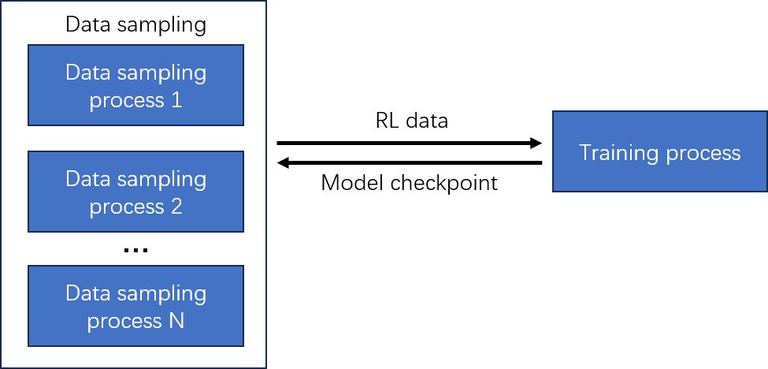

# Learning Modular Policy for Multi-Floor Object Navigation: A Factorized Framework for Diagnostic Study


## Dependencies
- cuda version:
```bash
nvcc: NVIDIA (R) Cuda compiler driver
Copyright (c) 2005-2022 NVIDIA Corporation
Built on Wed_Jun__8_16:49:14_PDT_2022
Cuda compilation tools, release 11.7, V11.7.99
Build cuda_11.7.r11.7/compiler.31442593_0
```

- GPU: NVIDIA A6000

## Solution description

This project uses an asynchronous parallel reinforcement learning pipeline for multi-floor object navigation. Multiple data sampling processes are launched independently with `python -m vlfm.run`; each process interacts with a Habitat environment and continuously generates RL transitions in the form of `(state, action, reward, next_state, terminal)`.

The sampling processes do not train the policy directly. Instead, they write transitions into the shared replay buffer directory `sac_buffer_data_multi_process/`. At the same time, each RL step creates a step/reward marker file in `main_process_info/step_rewards/`, which provides a lightweight progress signal for the main training process.

The main training process is launched separately with `python train_main_process.py`. It polls the step/reward markers and, whenever the number of newly collected samples reaches `delta_steps`, loads batches from `sac_buffer_data_multi_process/` and updates the SACD actor-critic policy. After each training update, the newest actor and critic checkpoints are saved under `Models_train_PPO_intra/policy/multi_process_sac/`.

Because data collection and training are decoupled through shared files, sampling does not need to wait for training to finish, and training does not block the Habitat workers. When a data sampling process detects a newer actor checkpoint, it hot-loads the updated actor and continues collecting data with the latest policy.



## Quick start
### 1. Create the Conda environment

This project uses Conda to manage dependencies. Please make sure that Conda or Miniconda has been installed on your machine.

```bash
git clone https://github.com/zhai-create/vlfm_multi_floors_rl_learning.git
cd vlfm_multi_floors_rl_learning

conda env create -f environment.yaml

conda activate vlfm_percept
```

### 2. Create the data buffer and model buffer
```bash
cd vlfm_multi_floors_rl_learning
mkdir -p main_process_info/step_rewards # save the RL steps
mkdir sac_buffer_data_multi_process # save the RL data
mkdir Models_train_PPO_intra/policy/multi_process_sac # save the model
```

### 3. Set the card and process_id (before each peocess)

Open the ```vlfm_multi_floors_rl_learning/vlfm/arguments.py```, set the "card_select" and "process_id" before start each process(including all data sampling processes and training processes).

### 4. Start data sampling process
For each data sample process, you should:
```bash
# Start the perception module for each data sampling process:
cd vlfm_multi_floors_rl_learning
bash scripts/launch_vlm_servers.sh

# Start each data sampling process:
python -m vlfm.run
```
You can create multiple data sampling processes by following the above steps.


### 5. Start training process
```bash
cd vlfm_multi_floors_rl_learning
python train_main_process.py
```


## Time cost statistics
We used asynchronous training, which means that the **data collection process** does not wait for the **training process**. When the training process generates a new model, the data collection process automatically loads the newest model.

- The relationship between the number of data sampling processes and training time is as follows:

| Data Collection Process | Average Training Time per Epoch (s) |
|:---:|:---:|
| Single process | 387.88 |
| Two processes | 240.01 |

- The relationship between the number of data sampling processes and data sampling time is as follows:

| Data Collection Process | Data Collection Time per 100 Samples (s) |
|:---:|:---:|
| Single process | 327.76 |
| Two processes | 172.52 |
| Four processes | 90.81 |
